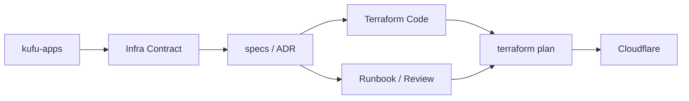

# Kufu Infra Design Docs

## Latest Updated At

- 2026-05-08

## Related PRD

- [PRD.md](../PRD.md)

## Repository References

- app repo: `$(ghq root)/github.com/Fukuemon/kufu-apps`
- infra repo: `$(ghq root)/github.com/Fukuemon/kufu-infra`

## Goal

Kufu apps が依存する Cloudflare 基盤を Terraform で再現可能に管理し、preview /
production、DNS、Pages、Workers、secret、binding、rollback の運用境界を明確にする。

## Non Goals

- app の product requirements、UI、routing、content、component 設計をこの repo の正本にすること。
- app code、frontend package、E2E test 本体をこの repo で実装すること。
- Cloudflare provider token、Terraform state、secret 実値を repository に保存すること。
- Cloudflare Dashboard の手作業を infra の正本にすること。

## Background

### 前提用語

- app repo: `kufu-apps`。product requirements、Design Docs、app 実装の正本を置く。
- infra repo: `kufu-infra`。Cloudflare と Terraform に関する infra 正本を置く。
- infra contract: app repo から参照する project 名、domain、secret 名、binding 名、environment 名。
- managed resource: Terraform で管理する Cloudflare resource。
- unmanaged operation: Terraform 管理外の dashboard 手作業。例外扱いとし、後続で import または ADR 化する。
- environment: local、preview、production など deploy / runtime の境界。
- plan / apply: Terraform の差分確認と反映手順。

### 背景

Cloudflare Pages、Workers、DNS、custom domain、secret、binding は本番影響が大きく、app 実装とは
異なる review 観点を必要とする。`kufu-infra` はこれらの infra resource を Terraform で管理し、
変更理由、plan、apply、rollback、secret boundary を追跡可能にする。

app 側の PRD と Design Docs は `kufu-apps` に寄せる。この repo では app が依存する infra contract と、
その contract を成立させる Cloudflare resource の実体管理だけを扱う。

## Overview

`kufu-infra` は、Terraform code、Cloudflare resource、environment contract、operation docs、
spec / ADR workflow の 5 領域で構成する。

## Detailed Design

### Repository Responsibilities

| 領域        | Responsibility                                                                        |
| ----------- | ------------------------------------------------------------------------------------- |
| `terraform` | Cloudflare resource の module、environment、variable、provider 設定を管理する想定領域 |
| `design`    | infra 全体設計、environment、state、secret、contract の設計を管理する                 |
| `specs`     | issue / infra 変更単位で要求、論点、plan、rollback、検証観点を整理する                |
| `adr`       | provider、state、module 境界、運用方針など長期参照する決定を残す                      |
| `.rulesync` | AI provider 向け rules / skills / hooks の正本を管理する                              |

### Cloudflare Resource Boundary

- Pages project、production branch、preview deployment、custom domain は Terraform 管理対象とする。
- DNS record、redirect、cache rule、TLS、compression は Cloudflare 側の resource として管理対象候補に含める。
- Workers、Routes、KV / D1 / R2 / Queues、Pages Functions binding は必要になった時点で spec と ADR を作る。
- Turnstile、Web Analytics、bot protection、rate limiting は app 要件が具体化した時点で infra spec に切る。
- dashboard 手作業が発生した場合は、理由、作業者、日時、後続の Terraform import 要否を記録する。

### Terraform Architecture

- Terraform code は Cloudflare provider を主軸にする。
- provider credential は local secret store、CI secret、または approved operator の環境変数で注入し、repo に保存しない。
- state backend は ADR で固定するまでは Design Docs 上の open decision とし、state file を repo に置かない。
- module は Cloudflare resource の責務ごとに分け、environment 差分は variable や environment directory で表現する。
- `terraform plan` を review gate とし、`apply` は明示された operator または CI job のみが実行する。
- resource import や state 移動は通常変更よりリスクが高いため、spec に rollback と検証手順を必ず残す。

### Environment Strategy

| Environment | Purpose                        | Infra Responsibility                                               |
| ----------- | ------------------------------ | ------------------------------------------------------------------ |
| local       | app developer のローカル確認   | Cloudflare 依存を必須にせず、必要な contract 名だけ参照可能にする  |
| preview     | PR / branch ごとの実ページ確認 | Pages preview、preview domain、preview secret / binding を管理する |
| production  | 公開環境                       | production domain、DNS、TLS、secret、binding、rollback を管理する  |

- preview と production で secret 実値を共有しない。
- production domain や DNS record の変更は spec と plan を必須にする。
- branch / PR に紐づく preview URL は app repo の review と相互参照できるようにする。

### Secret / Runtime Boundary

- secret 実値、API token、provider credential、Terraform state は repository に保存しない。
- repository に残すのは secret 名、用途、environment、参照主体、rotation 方針だけにする。
- client bundle に露出してよい値と Cloudflare runtime secret を分ける。
- Workers や Pages Functions が第三者 API を中継する場合、binding と secret の所有は infra repo で管理する。
- secret の追加、削除、rotation は spec または runbook で影響範囲と rollback を明示する。

### Cross-Repo Contract

- app repo は product / app implementation の正本を持つ。
- infra repo は Cloudflare resource と Terraform implementation の正本を持つ。
- app が infra へ要求するものは contract として表現する。
  - Pages project 名
  - preview / production domain
  - required secret 名
  - Workers / Pages Functions binding 名
  - environment variable 名
  - deploy trigger / branch 前提
- app 側変更で infra 差分が必要な場合は、app 側 issue / spec / ADR と infra 側 issue / spec / ADR を相互参照する。

### Operations / Review

- すべての本番影響変更は `terraform plan` の差分を review する。
- `apply` は plan と一致する範囲だけ実行する。
- plan に destroy、replacement、DNS、secret、state migration が含まれる場合は明示 review を必須にする。
- rollback は Terraform revert、Cloudflare deployment rollback、DNS record restore など resource 種別ごとに定義する。
- drift detection は定期確認または変更前確認のどちらかで実施し、差分があれば spec / ADR に反映する。

### 主要ユースケース

#### 1. Cloudflare Pages project を追加する

1. app repo の要求と infra contract を確認する。
2. infra spec を作成し、project 名、production branch、preview、domain、secret、binding を決める。
3. Terraform resource を追加する。
4. `terraform plan` で新規作成差分を確認する。
5. apply 後、preview / production の URL と contract を docs に反映する。

#### 2. DNS / custom domain を変更する

1. 対象 domain、record、TTL、proxy、TLS 影響を spec に書く。
2. Cloudflare plan に destroy / replacement がないか確認する。
3. rollback 用の旧 record と確認手順を残す。
4. apply 後、名前解決、TLS、redirect、cache の動作を確認する。

#### 3. secret / binding を追加する

1. secret 名、参照 environment、利用主体、rotation 方針を contract に書く。
2. secret 実値は Cloudflare secret store または CI secret に注入し、repo に保存しない。
3. app repo 側に必要な env 名だけを共有する。
4. preview と production の値が分離されていることを確認する。

#### 4. Workers を導入する

1. Workers が必要な理由を app repo の要求と infra spec で確認する。
2. route、binding、secret、observability、rollback を設計する。
3. Terraform resource と deploy workflow の責務を分ける。
4. production traffic に入れる前に preview または staging 相当で確認する。

## Alternatives Considered

### Cloudflare Dashboard を正本にする

- 利点: 初期設定が速い。
- 欠点: review、履歴、再現性、drift detection、rollback が弱い。
- 不採用理由: Kufu infra は本番影響を review 可能な差分として管理したいため。

### app repo に Terraform を同居させる

- 利点: app 変更と infra 変更を同じ PR で扱いやすい。
- 欠点: secret、state、apply 権限が app 実装導線に近づき、review 観点が混ざる。
- 不採用理由: app product 正本と infra 実体管理を分離し、責務と権限を明確にするため。

### Cloudflare 以外の provider を初期採用する

- 利点: provider lock-in を避けやすい。
- 欠点: Phase 1 の公開基盤に対して複雑性が高い。
- 不採用理由: 初期は Cloudflare の Pages / Workers / DNS / CDN で閉じる方が運用負荷を抑えられるため。

## Caveats / Security / Privacy

- secret 実値、provider token、Terraform state を repository に保存しない。
- `terraform plan` に secret 値や sensitive output が露出しないようにする。
- production DNS、domain、Workers route、secret rotation は本番影響が大きいため spec と review を必須にする。
- dashboard 手作業をした場合は Terraform state との drift を必ず確認する。
- app repo へ共有するのは contract 名であり、秘匿値ではない。

## Test Plan

- Terraform fmt / validate が通ること。
- Cloudflare provider の plan が意図した resource 差分だけを示すこと。
- plan に destroy / replacement / secret exposure がないか確認すること。
- preview / production の Pages URL、custom domain、DNS、TLS が期待どおりであること。
- Workers を導入する場合は route、binding、secret、observability、rollback を確認すること。
- docs / specs / skills から apps 由来の不要な UI / product 前提が除去されていること。

## Open Questions

- Terraform state backend をどこに置くか。
- plan / apply を local operator 実行にするか、CI job に寄せるか。
- Cloudflare account / zone / Pages project の命名規約をどの粒度で固定するか。
- drift detection を定期 automation にするか、変更前 checklist にするか。
- app repo との infra contract を専用ファイルに切り出すか、spec / Design Docs に置くか。
